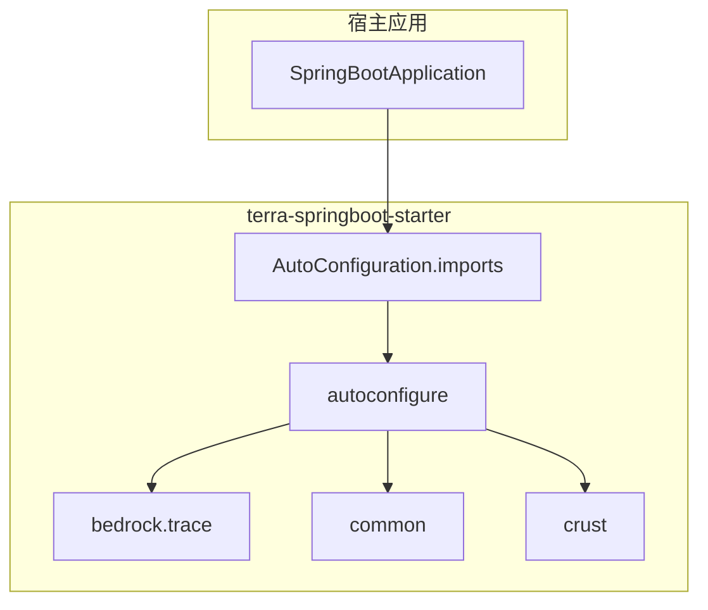

# Terra Spring Boot Starter：架构总览

## 目标与范围

`terra-springboot-starter` 是单一 Maven 构件，将原先分散在多个模块（`bedrock`、`sediment`、`crust`、`autoconfigure`）中的基础设施打成一个包。面向 **Java 21** 与 **Spring Boot 3.4.5**，适合需要以下能力的应用：

- 链路 TraceId 与 SLF4J MDC 联动
- 统一 HTTP API 返回体封装与全局异常处理
- 可选的请求/响应体访问日志
- 与 Spring `ObjectMapper` 绑定的 JSON 工具
- 类雪花算法的 ID 生成工具
- 少量共享工具（加解密、布隆过滤器等）

本 Starter **不包含**：数据访问（MyBatis、多数据源）、缓存抽象、Spring AI 等；这些在瘦身后的布局中已移除。

## 分层与包结构

| 层次 | Java 包根 | 职责 |
| ---- | --------- | ---- |
| 追踪核心 | `com.terra.framework.bedrock.trace` | TraceId 生成、线程内日志上下文、异步传递辅助 |
| Web 域 | `com.terra.framework.crust` | MVC 增强、全局异常、Web 工具、请求头扩展点 |
| 共享模型与工具 | `com.terra.framework.common` | `Result` 契约、工具（加解密、雪花序列、布隆过滤器等） |
| Spring 集成 | `com.terra.framework.autoconfigure` | `@AutoConfiguration`、过滤器、拦截器、`@EnableConfigurationProperties` 与各 `terra.*` 属性类 |

## 自动配置注册

自动配置类登记在：

`terra-springboot-starter/src/main/resources/META-INF/spring/org.springframework.boot.autoconfigure.AutoConfiguration.imports`

文件中顺序如下（Spring Boot 还会结合 `@AutoConfigureAfter` 与条件注解）：

| 文件内顺序 | 类 | 作用 |
| ---------- | -- | ---- |
| 1 | `LogAutoConfiguration` | 缺失时注册 `LogPattern` |
| 2 | `JsonAutoConfiguration` | 注册 `Jackson2ObjectMapperBuilderCustomizer` 应用 `terra.json.*`；初始化静态 `JsonUtils` |
| 3 | `SnowflakeAutoConfiguration` | 注册 `SnowflakeUtils` Bean |
| 4 | `TerraTraceAutoConfiguration` | Trace 过滤器、`TraceContextHolder`、`TraceHelper` 初始化、可选 `TraceDataCollector` |
| 5 | `TerraWebAutoConfiguration` | MVC 拦截器、CORS、`ResponseAdvice`、`RestExceptionHandler`、`TerraLoggingFilter`、`RestTemplate` Trace 透传 |

`TerraWebAutoConfiguration` 显式排在 `TerraTraceAutoConfiguration`、`JacksonAutoConfiguration`、`LogAutoConfiguration` 之后，以便 Web 层装配时公共 Bean 已就绪。

## 应用入口约定

本 Starter **不**提供专用启动注解。宿主应用使用标准的 `@SpringBootApplication` 即可：只要 classpath 上存在本依赖且未排除自动配置，Spring Boot 会加载 `AutoConfiguration.imports` 中的类。

各 `@ConfigurationProperties`（如 `TerraTraceProperties`、`JsonProperties` 等）均在对应 `@AutoConfiguration` 上通过 `@EnableConfigurationProperties` 注册，**不需要**在宿主应用上增加 `@ConfigurationPropertiesScan` 来扫描本库。

若业务代码放在与主类不同的包下，请通过 `@SpringBootApplication` 的 `scanBasePackages`（或 `@ComponentScan`）自行指定组件扫描范围；这与 Starter 的自动配置无关。

## Maven 坐标

- **GroupId：** `com.terra.framework`
- **ArtifactId：** `terra-springboot-starter`
- **Version：** 与父工程一致（例如 `0.0.1-SNAPSHOT`）

传递能力主要来自 `spring-boot-starter-web`（含 `spring-boot-starter-json` 等传递依赖）。

## 相关文档

- [02-trace-and-logging.md](./02-trace-and-logging.md)
- [03-web-enhancements.md](./03-web-enhancements.md)
- [04-common-utilities.md](./04-common-utilities.md)
